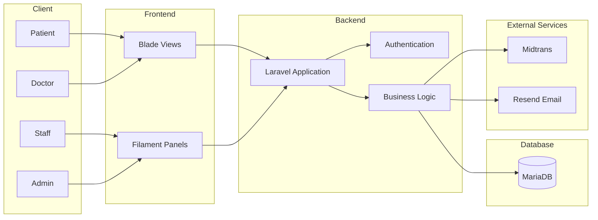

# 🏥 HealthMesh

HealthMesh adalah platform manajemen layanan kesehatan berbasis web yang menghubungkan pasien, dokter, staf rumah sakit, dan administrator dalam satu sistem terintegrasi. Aplikasi ini dibangun menggunakan Laravel 13, Filament, MariaDB, dan Midtrans untuk mendukung proses pendaftaran pasien, penjadwalan dokter, rekam medis elektronik, antrean, hingga pembayaran tagihan.

## 🌐 Live Demo

**Production Deployment**

https://healthmesh.site

---

## ✨ Fitur Utama

### 👤 Pasien

* Registrasi akun pasien
* Login dan autentikasi pengguna
* Verifikasi email
* Melihat daftar rumah sakit yang tersedia
* Enrollment ke rumah sakit
* Booking jadwal dokter
* Melihat riwayat appointment
* Membatalkan appointment
* Melihat rekam medis
* Melihat resep obat
* Melihat tagihan
* Pembayaran tagihan secara online
* Mengelola profil pribadi

### 👨‍⚕️ Dokter

* Melihat daftar pasien
* Mengakses data appointment
* Membuat dan mengelola rekam medis
* Membuat resep obat
* Melihat jadwal praktik

### 👨‍💼 Staff Rumah Sakit

* Registrasi pasien walk-in
* Mengelola antrean pasien
* Membantu proses administrasi layanan

### 👨‍💻 Administrator

* Mengelola rumah sakit
* Mengelola dokter
* Mengelola staf
* Mengelola spesialisasi dokter
* Mengelola jadwal praktik
* Monitoring data sistem melalui Filament Admin Panel

---

## 🏗️ Teknologi yang Digunakan

### Backend

* PHP 8.3
* Laravel 13

### Admin Panel

* Filament

### Database

* MariaDB / MySQL

### Frontend

* Blade
* Tailwind CSS
* Vite

### Integrasi

* Midtrans Payment Gateway
* Resend Email Service

### Deployment

* Railway
* Ngrok (untuk pengembangan lokal dan pengujian email)

---

## 📦 Package Utama

```json
{
  "laravel/framework": "^13.0",
  "filament/filament": "*",
  "livewire/livewire": "^4.3",
  "midtrans/midtrans-php": "^2.6",
  "resend/resend-php": "^1.3",
  "laravel/sanctum": "^4.0"
}
```

---

## 🗄️ Struktur Data Utama

Sistem menggunakan beberapa entitas utama:

* Users
* Hospitals
* Doctors
* Staff
* Specializations
* Schedules
* Appointments
* Medical Records
* Prescriptions
* Medications
* Bills
* Bill Items
* Queues
* Patient Enrollments
* Patient Medical Information

---

## 🔐 Role Pengguna

| Role     | Deskripsi                           |
| -------  | ---------------------------------   |
| S. Admin | Mengelola seluruh sistem            |
| Admin    | Mengelola sistem sebuah rumah sakit |
| Doctor   | Mengelola layanan medis             |
| Staff    | Mengelola operasional rumah sakit   |
| Patient  | Mengakses layanan kesehatan         |
---

## 💳 Sistem Pembayaran

HealthMesh terintegrasi dengan Midtrans untuk mendukung pembayaran tagihan pasien secara online.

Fitur pembayaran meliputi:

* Pembuatan transaksi pembayaran
* Status pembayaran
* Halaman sukses pembayaran
* Halaman pembayaran gagal
* Halaman pembayaran tertunda

Route terkait:

```text
/payment/{bill}
/payment/success
/payment/unfinish
/payment/error
```

---

## 📧 Pengiriman Email

Sistem menggunakan layanan email untuk:

* Verifikasi email pengguna
* Notifikasi autentikasi
* Proses reset password

Saat pengembangan lokal digunakan Ngrok agar URL aplikasi dapat diakses dari luar localhost dan tautan yang dikirim melalui email tetap dapat digunakan.

Contoh:

```bash
php artisan serve
ngrok http 8000
```

Kemudian ubah:

```env
APP_URL=https://your-ngrok-url.ngrok-free.app
```

---

## 🚀 Instalasi Lokal

### 1. Clone Repository

```bash
git clone https://github.com/byuubub/Tubes_PWL_Kelompok8.git
cd Tubes_PWL_Kelompok8
```

### 2. Install Dependency

```bash
composer install
npm install
```

### 3. Salin Environment

```bash
cp .env.example .env
```

### 4. Generate Key

```bash
php artisan key:generate
```

### 5. Konfigurasi Database

Edit file `.env`

```env
DB_CONNECTION=mysql
DB_HOST=127.0.0.1
DB_PORT=3306
DB_DATABASE=healthmesh
DB_USERNAME=root
DB_PASSWORD=
```

### 6. Jalankan Migrasi

```bash
php artisan migrate
```

Jika menggunakan seeder:

```bash
php artisan db:seed
```

### 7. Jalankan Aplikasi

```bash
php artisan serve
npm run dev
```

Aplikasi dapat diakses pada:

```text
http://127.0.0.1:8000
```

---

## 🛠️ Development Command

Menjalankan seluruh service development:

```bash
composer run dev
```

Perintah ini akan menjalankan:

* Laravel Server
* Queue Listener
* Laravel Pail
* Vite Development Server

---

## 📂 Struktur Route Penting

### Guest

```text
/
```

### Patient Panel

```text
/user/patient/dashboard
/user/patient/appointments
/user/patient/medical-records
/user/patient/prescriptions
/user/patient/bills
/user/patient/profile
/user/patient/hospitals
```

### Admin Panel

```text
/admin
```

---

## 👨‍🎓 Proyek Akademik

HealthMesh dikembangkan sebagai proyek mata kuliah **Pemrograman Web Lanjut (PWL)** untuk mengimplementasikan konsep:

* Laravel Framework
* MVC Architecture
* Authentication & Authorization
* Database Relationship
* Payment Gateway Integration
* Email Verification
* Admin Panel Development
* Deployment dan DevOps Dasar

---

## 🏛️ Application Architecture



## 👨‍💻 Tim Pengembang

Proyek **HealthMesh** dikembangkan sebagai bagian dari tugas mata kuliah **Pemrograman Web Lanjut (PWL)**.

### Kelompok 8

| Nama                  | NIM       | Peran           |
| --------------------- | --------- | --------------- |
| Bayu Pranoto          | 251402066 | Project Manager |
| Yabesh Day Siahaan    | 251402004 | Developer       |
| Chris Martin          | 251402116 | Developer       |
| Muhammad Kevin        | 251402013 | Developer       |
| Muhammad Izyan Roshan | 251402110 | Developer       |


Melalui kolaborasi tim, HealthMesh berhasil mengimplementasikan sistem layanan kesehatan digital yang mencakup manajemen pasien, dokter, rumah sakit, rekam medis, pembayaran online, serta administrasi layanan kesehatan secara terintegrasi.


## 📄 Lisensi

Proyek ini dikembangkan untuk tujuan pembelajaran dan akademik.
